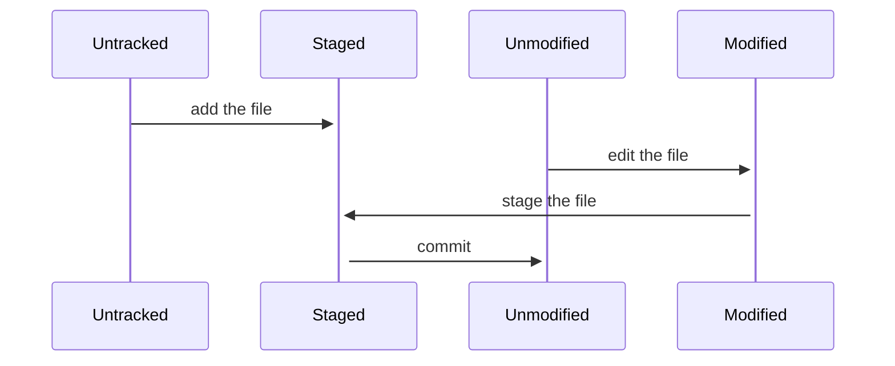

# mygit

Learning to use Git

## Status of Files

Each file can be in one of two states: _tracked_ or _untracked_.

```mermaid
sequenceDiagram
    Untracked->>+Staged: add the file
    Unmodified->>+Modified: edit the file
    Modified->>+Staged: stage the file
    Staged->>+Unmodified: commit
```

## Status of Your Files

